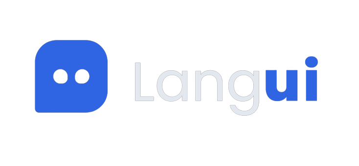

  

<h3 align="center">The perfect UI for your AI</h3>

  
  
  

LangUI is an Open Source Tailwind library with free components tailored for your AI and GPT projects. It offers a collection of beautiful, ready-to-use components to enhance the user interface of your AI applications, allowing you to focus on building the next best project while leaving the UI to LangUI.

## Documentation

For documentation and components, visit [LangUI.dev](https://www.langui.dev/).

## Get Started

- LangUI components are ready-to-use, meaning you don't need to install or configure anything.

- Browse [LangUI.dev](https://www.langui.dev/) and select a comopnent.

- Copy the desired component's code in HTML or JSX from the LangUI documentation.

- Paste the code into your project's HTML or React/Vue/Angular components. Done.

## Features

- **Copy & Paste Integration**: Zero installations or dependencies! Simply choose your desired component, copy, and paste it into your project.

- **Open Source & Free**: LangUI is MIT licensed, making it suitable for both personal and commercial projects. Feel free to contribute and support us by starring LangUI on GitHub.

- **Dark & Light Modes**: All LangUI components support light & dark modes and are carefully designed to look the best across both modes.

- **Fully Responsive**: LangUI components are responsive, ensuring they look fantastic on any screen size or device.

- **Easy Customization**: LangUI uses a two-color-only pallete. The two color pallete - slate and blue - allows for effortless customization into your brand's colors.

## Request a Component

Have an idea for a new component? We'd love to hear from you! Simply head over to our [GitHub repository](https://github.com/ahmadbilaldev/LangUI) and submit your component request. Let's collaborate and cook up something spicy together!

## Contributing

Contributions to LangUI are highly welcome! Whether it's bug fixes, new components, or improvements, we appreciate your support in making this library better for the AI community. Please read our [contribution guidelines](CONTRIBUTING.md) to get started.

## License

LangUI is licensed under the [MIT License](LICENSE).

---

Enjoy using LangUI to build stunning UIs for your AI and GPT projects. If you find it helpful, don't forget to give it a star on GitHub! For any queries or issues, feel free to open an [issue](https://github.com/ahmadbilaldev/LangUI/issues) on the repository.

Happy coding! 😊
